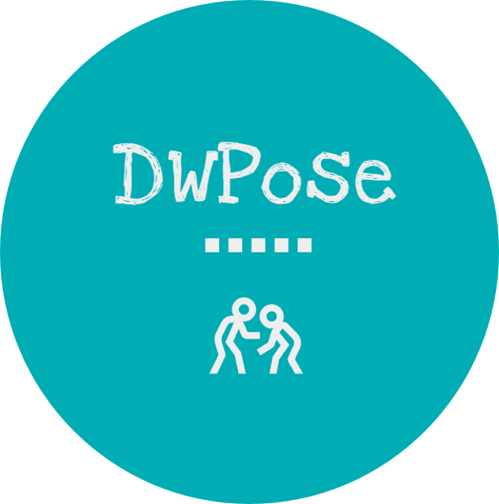
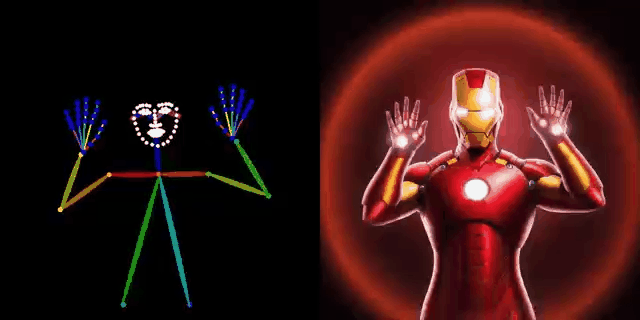
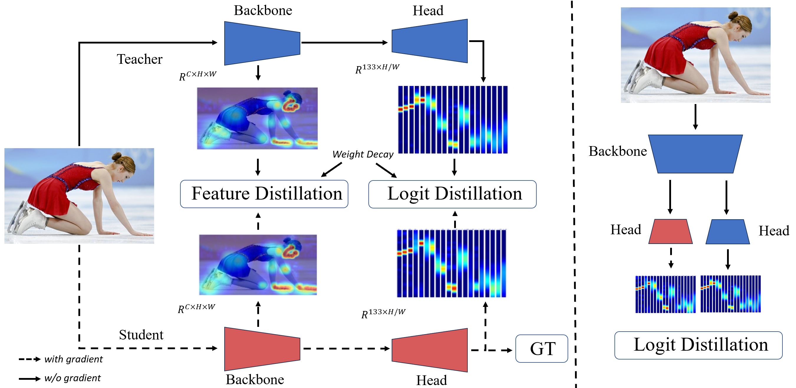
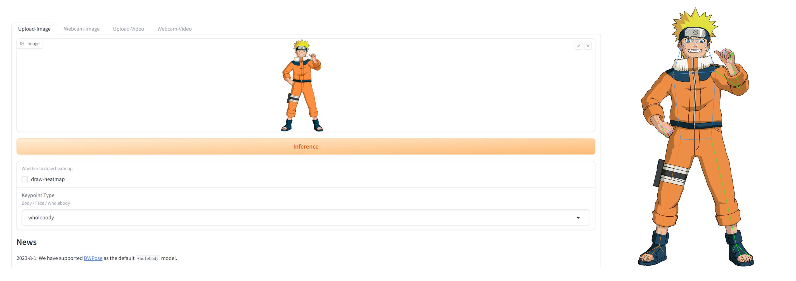
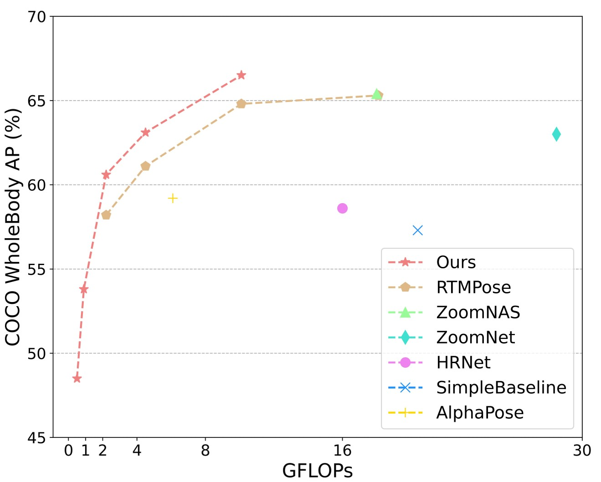
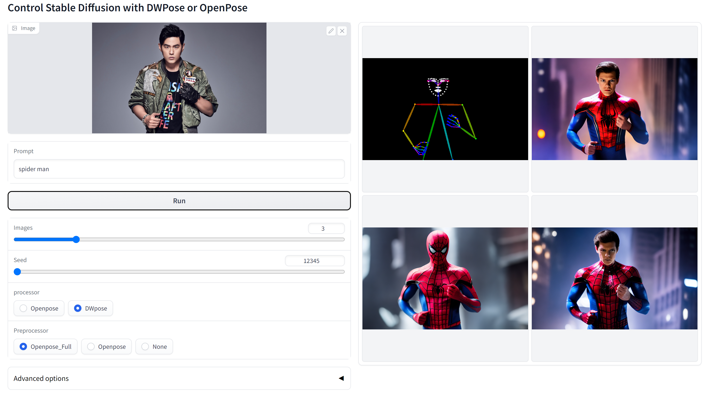

<div align="center">
<p align="center">  </p>
<h2>Effective Whole-body Pose Estimation with Two-stages Distillation </h2> 

<a href='https://arxiv.org/abs/2307.15880'></a>

[](https://paperswithcode.com/sota/2d-human-pose-estimation-on-coco-wholebody-1?p=effective-whole-body-pose-estimation-with-two)


[Zhendong Yang](https://yzd-v.github.io/page/), [Ailing Zeng](https://ailingzeng.site/), [Chun Yuan](https://scholar.google.com/citations?user=fYdxi2sAAAAJ&hl=en&oi=sra), [Yu Li](http://yu-li.github.io/)


     
<p>&emsp; &emsp; &emsp; &emsp; &emsp; DWPose   &emsp;   &emsp;   &emsp; &emsp;   &emsp; &emsp; &emsp;   &emsp;&emsp; &emsp;   &emsp; DWPose + ControlNet (<i>prompt: Ironman</i>) </p>

</div>

#  💃🏻  DWPose 💃🏻
This repository is the official implementation of the [Effective Whole-body Pose Estimation with Two-stages Distillation](https://arxiv.org/abs/2307.15880) (ICCV 2023, CV4Metaverse Workshop). Our code is based on [MMPose](https://github.com/open-mmlab/mmpose/tree/main) and [ControlNet](https://github.com/lllyasviel/ControlNet-v1-1-nightly).

<p align="center">


⚔️ We release a series of models named DWPose with different sizes, from tiny to large, for human whole-body pose estimation. Besides, we also replace Openpose with DWPose for ControlNet, obtaining better Generated Images. 

## 🔥 News
- **`2023/12/03`**: DWPose supports [Consistent and Controllable Image-to-Video Synthesis for Character Animation](https://humanaigc.github.io/animate-anyone/).
- **`2023/08/17`**: Our paper [Effective Whole-body Pose Estimation with Two-stages Distillation](https://arxiv.org/abs/2307.15880) is accepted by ICCV 2023, CV4Metaverse Workshop. 🎉 🎉 🎉

- **`2023/08/09`**: You can try DWPose with [sd-webui-controlnet](https://github.com/Mikubill/sd-webui-controlnet) now! Just update your sd-webui-controlnet >= v1.1237, then choose dw_openpose_full as preprocessor.

- **`2023/08/09`**: We support to run onnx model with cv2. You can avoid installing onnxruntime. See branch [opencv_onnx](https://github.com/IDEA-Research/DWPose/tree/opencv_onnx).
- **`2023/08/07`**: We upload all DWPose models to [huggingface](https://huggingface.co/yzd-v/DWPose/tree/main). Now, you can download them from baidu drive, google drive and huggingface.
- **`2023/08/07`**: We release a new DWPose with onnx. You can avoid installing mmcv through this. See branch [onnx](https://github.com/IDEA-Research/DWPose/tree/onnx).
- **`2023/08/01`**: Thanks to [MMPose](https://github.com/open-mmlab/mmpose/tree/main). You can try our DWPose with this [demo](https://openxlab.org.cn/apps/detail/mmpose/RTMPose) by choosing wholebody!

<p align="center">

## 🐟 Installation
See [installation instructions](INSTALL.md). This branch uses onnx. You can try DWPose for ControlNet without mmcv.

## 🚀 Results and Models
### 😎 DWPose on COCO. We release a series of DWPose models.

<p align="center">

Results on COCO-WholeBody v1.0 val with detector having human AP of 56.4 on COCO val2017 dataset

| Arch                                    | Input Size | FLOPS (G)| Body AP | Foot AP | Face AP | Hand AP | Whole AP |                   ckpt                   |                   ckpt                   |
| :-------------------------------------- | :--------: | :--------: | :-----: | :-----: | :-----: | :-----: | :------: | :--------------------------------------: | :-------------------------------------: |
| [DWPose-t](mmpose/configs/wholebody_2d_keypoint/rtmpose/ubody/rtmpose-t_8xb64-270e_coco-ubody-wholebody-256x192.py) |  256x192   |0.5|  0.585  |  0.465  |  0.735  |  0.357  |  0.485   | [baidu drive](https://pan.baidu.com/s/1X2sVxv4JOZ5WFvOBiwjrNA?pwd=nmvw) | [google drive](https://drive.google.com/file/d/1Csbg56QvB0TtFamJ6pPWNil7h6WziDwl/view?usp=sharing) |
| [DWPose-s](mmpose/configs/wholebody_2d_keypoint/rtmpose/ubody/rtmpose-s_8xb64-270e_coco-ubody-wholebody-256x192.py) |  256x192   |0.9|  0.633  |  0.533  |  0.776  |  0.427  |  0.538   | [baidu drive](https://pan.baidu.com/s/1k2JxCtJL9dIGU-h31UBQOA?pwd=hcf2) | [google drive](https://drive.google.com/file/d/10TuEeLhArxfd4e6bnE7YgmBI9RFvu9DL/view?usp=sharing) |
| [DWPose-m](mmpose/configs/wholebody_2d_keypoint/rtmpose/ubody/rtmpose-m_8xb64-270e_coco-ubody-wholebody-256x192.py) |  256x192   |2.2|  0.685  |  0.636  |  0.828  |  0.527  |  0.606   | [baidu drive](https://pan.baidu.com/s/183ovcYHV6I5TQ9Wu1eS-eg?pwd=rcry) | [google drive](https://drive.google.com/file/d/13ZWnGDteGBmjALtErYS8AHhMBBNAN9en/view?usp=sharing) |
| [DWPose-l](mmpose/configs/wholebody_2d_keypoint/rtmpose/ubody/rtmpose-l_8xb64-270e_coco-ubody-wholebody-256x192.py) |  256x192   |4.5|  0.704  |  0.662  |  0.843  |  0.566  |  0.631   | [baidu drive](https://pan.baidu.com/s/1bWEeiFL5UGoDj9Nkazb98w?pwd=u7ek) | [google drive](https://drive.google.com/file/d/1PHKN3p873dgCSh_YRsYqTZVj-kIbclRS/view?usp=sharing) |
| [DWPose-l](mmpose/configs/wholebody_2d_keypoint/rtmpose/ubody/rtmpose-l_8xb32-270e_coco-ubody-wholebody-384x288.py) |  384x288   |10.1|  0.722  |  0.704  |  0.887  |  0.621  |  0.665   | [baidu drive](https://pan.baidu.com/s/168T2XGXQDli8j03e_dOJdg?pwd=ajcq) | [google drive](https://drive.google.com/file/d/1Oy9O18cYk8Dk776DbxpCPWmJtJCl-OCm/view?usp=sharing) |

### 🦈 DWPose for ControlNet.
First, you need to download our Pose model dw-ll_ucoco_384.onnx ([baidu](https://pan.baidu.com/s/1nuBjw-KKSxD_BkpmwXUJiw?pwd=28d7), [google](https://drive.google.com/file/d/12L8E2oAgZy4VACGSK9RaZBZrfgx7VTA2/view?usp=sharing)) and Det model yolox_l.onnx ([baidu](https://pan.baidu.com/s/1fpfIVpv5ypo4c1bUlzkMYQ?pwd=mjdn), [google](https://drive.google.com/file/d/1w9pXC8tT0p9ndMN-CArp1__b2GbzewWI/view?usp=sharing)), then put them into ControlNet-v1-1-nightly/annotator/ckpts. Then you can use DWPose to generate the images you like.
```
cd ControlNet-v1-1-nightly
python gradio_dw_open_pose.py
```

#### Non-cherry-picked test with random seed 12345 ("spider man"):
<p align="center">

#### Comparison with OpenPose
<p align="center">

#### Run inference on any images

```
cd ControlNet-v1-1-nightly
python dwpose_infer_example.py
```
Note: Please change the image path and output path based on your file.


## 🚢 Datasets
Prepare [COCO](https://cocodataset.org/#download) in mmpose/data/coco and [UBody](https://github.com/IDEA-Research/OSX) in mmpose/data/UBody.

UBody needs to be tarnsferred into images. Don't forget.
```
cd mmpose
python video2image.py
```
If you want to evaluate the models on UBody
```
# add category into UBody's annotation
cd mmpose
python add_cat.py
```
## ⭐Train a model
### Train DWPose with the first stage distillation
```
cd mmpose
bash tools/dist_train.sh configs/distiller/ubody/s1_dis/rtmpose_x_dis_l__coco-ubody-256x192.py 8
```
### Train DWPose with the second stage distillation
```
cd mmpose
bash tools/dist_train.sh configs/distiller/ubody/s2_dis/dwpose_l-ll__coco-ubody-256x192.py 8
```
### Tansfer the distillation models into regular models
```
cd mmpose
# if first stage distillation
python pth_transfer.py $dis_ckpt $new_pose_ckpt
# if second stage distillation
python pth_transfer.py $dis_ckpt $new_pose_ckpt --two_dis
```
## ⭐Test a model
```
# test on UBody
bash tools/dist_test.sh configs/wholebody_2d_keypoint/rtmpose/ubody/rtmpose-l_8xb64-270e_ubody-wholebody-256x192.py $pose_ckpt 8

# test on COCO
bash tools/dist_test.sh configs/wholebody_2d_keypoint/rtmpose/ubody/rtmpose-l_8xb64-270e_coco-ubody-wholebody-256x192.py $pose_ckpt 8

```

## 🥳 Citation
```
@inproceedings{yang2023effective,
  title={Effective whole-body pose estimation with two-stages distillation},
  author={Yang, Zhendong and Zeng, Ailing and Yuan, Chun and Li, Yu},
  booktitle={Proceedings of the IEEE/CVF International Conference on Computer Vision},
  pages={4210--4220},
  year={2023}
}
```

## 🥂 Acknowledgement
Our code is based on [MMPose](https://github.com/open-mmlab/mmpose/tree/main) and [ControlNet](https://github.com/lllyasviel/ControlNet-v1-1-nightly).
